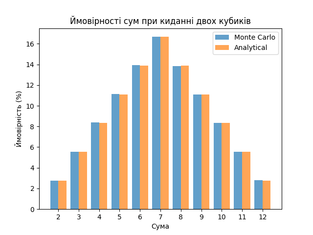

## Висновки щодо правильності розрахунків

### Графік:

### Результати:

| Сума | Монте-Карло                     | Аналітичні ймовірності   |  
| ---- | ------------------------------- | ------------------------ |  
| 2    | 2.77%                           | 2.78%                    | 
| 3    | 5.55%                           | 5.56%                    |  
| 4    | 8.37%                           | 8.33%                    |  
| 5    | 11.12%                          | 11.11%                   |  
| 6    | 13.92%                          | 13.89%                   |  
| 7    | 16.65%                          | 16.67%                   |  
| 8    | 13.83%                          | 13.89%                   |  
| 9    | 11.11%                          | 11.11%                   |  
| 10   | 8.33%                           | 8.33%                    |  
| 11   | 5.55%                           | 5.56%                    |  
| 12   | 2.79%                           | 2.78%                    |  

1. **Збіг результатів:**
   - Результати симуляції методом Монте-Карло майже повністю збігаються з аналітичними розрахунками. Для кожної суми (від 2 до 12) відхилення є мінімальними і знаходяться в межах статистичної похибки.

2. **Максимальна похибка:**
   - Ймовірності, отримані аналітично, є ідеальними, тому вони слугують базою для оцінки похибки. Відхилення між результатами методу Монте-Карло і аналітичними значеннями можна пояснити випадковістю при моделюванні великої кількості кидків.

3. **Точність моделі:**
   - Чим більше симуляцій (у даному випадку 100000), тим точніше результати Монте-Карло наближаються до аналітичних. Це підтверджує правильність алгоритму та підходу.

4. **Графічне підтвердження:**
   - На графіку видно, що ймовірності, отримані обома методами, мають майже однаковий розподіл. Це підтверджує, що метод Монте-Карло коректно моделює ймовірності.

5. **Застосування:**
   - Використання методу Монте-Карло є ефективним для імітації ймовірностей у складних моделях, де аналітичні розрахунки можуть бути складними. У цьому випадку, для простої задачі, метод продемонстрував високу відповідність аналітичним результатам.

### Підсумок:
Метод Монте-Карло є надійним підходом для розрахунку ймовірностей, оскільки його результати практично збігаються з аналітичними. Графічне представлення підтверджує правильність розрахунків.